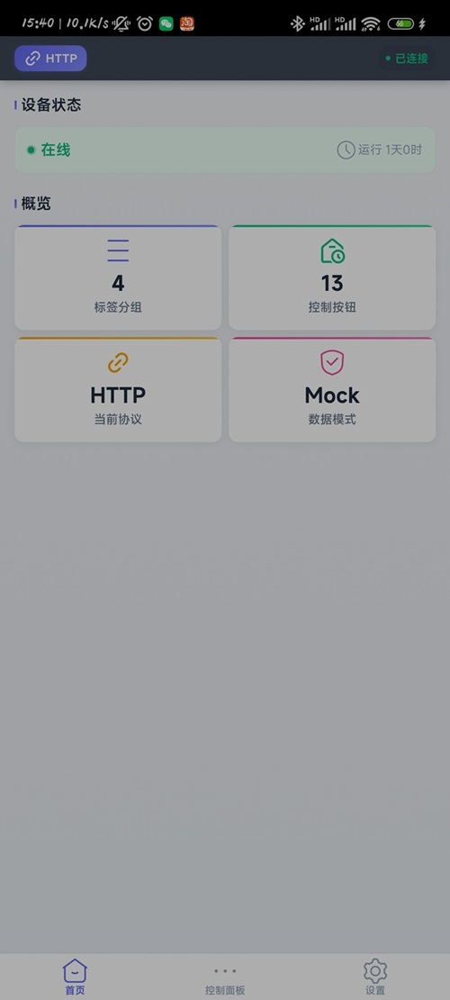
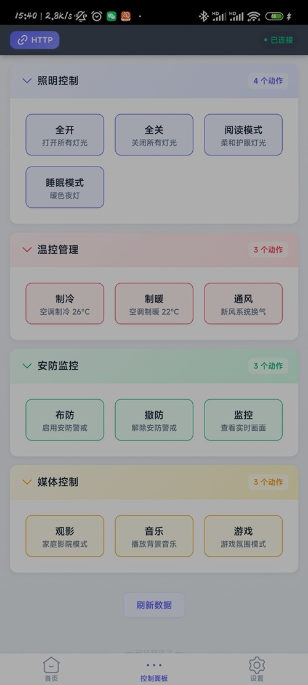
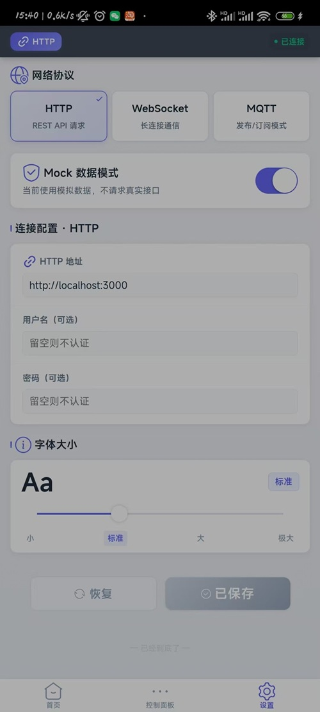

# AnyCtrl 控制面板

基于 [Taro 4.x](https://docs.taro.zone/) 的跨端控制面板应用，支持 H5、微信小程序和 App（React Native）三端运行。通过可切换的网络协议（HTTP / WebSocket / MQTT）控制设备，内置 Mock 数据模式，无需后端即可独立开发和调试。

## 技术栈

- **框架**: Taro 4.0.9（React 18）
- **UI 库**: NutUI 3.x（Taro 适配版）
- **语言**: TypeScript 5
- **状态管理**: zustand 4
- **MQTT**: mqtt.js 5（WebSocket 桥接）
- **样式**: SCSS

## 快速开始

```bash
# 安装依赖
pnpm install

# 微信小程序（开发模式）
pnpm dev:weapp
# 产物在 dist/ 目录，用微信开发者工具打开该目录即可预览

# H5（开发模式）
pnpm dev:h5
# 产物在 dist/ 目录，项目未启用 dev server，需手动启动本地服务器：
npx http-server dist -p 10086 -c-1
# 然后访问 http://127.0.0.1:10086

# 启动后端 http 服务器测试
node server/local-server.js
```

小程序编译产物在 `dist/` 目录，用微信开发者工具打开该目录即可预览。Android APK 由 GitHub Actions 自动构建，推送到 main/master 分支即可在 Actions 页面下载。

## 项目结构

```
AnyCtrl/
├── config/                     # Taro 构建配置
│   ├── index.ts                #   基础配置
│   ├── dev.ts                  #   开发环境
│   └── prod.ts                 #   生产环境
├── src/
│   ├── app.ts                  # 应用入口
│   ├── app.config.ts           # Taro 全局配置（页面路由、TabBar）
│   ├── app.scss                # 全局样式
│   │
│   ├── pages/                  # 页面
│   │   ├── index/              #   首页 — 健康状态 + 概览
│   │   ├── panel/              #   控制面板 — 标签分组按钮
│   │   └── settings/           #   设置 — 协议切换 + Mock 开关
│   │
│   ├── components/             # 公共组件
│   │   ├── ConnectionBar/      #   顶部连接状态条
│   │   ├── HealthBadge/        #   健康状态徽章
│   │   ├── ProtocolSwitch/     #   协议选择器
│   │   ├── TagGroup/           #   标签分组卡片
│   │   ├── ActionButton/       #   动作按钮
│   │   └── MockToggle/         #   Mock 开关
│   │
│   ├── network/                # 网络层（核心）
│   │   ├── adapters/
│   │   │   ├── http.ts         #   HTTP 适配器（Taro.request）
│   │   │   ├── websocket.ts    #   WebSocket 适配器（Taro.connectSocket）
│   │   │   └── mqtt.ts         #   MQTT 适配器（mqtt.js + WSS）
│   │   ├── factory.ts          #   ProtocolFactory — 策略工厂
│   │   ├── mock-interceptor.ts #   MockInterceptor — 装饰器拦截层
│   │   └── mock-data.ts        #   Mock 模拟数据
│   │
│   ├── store/
│   │   └── useAppStore.ts      # zustand 全局状态
│   │
│   ├── types/                  # TypeScript 类型定义
│   │   ├── data.ts             #   业务数据模型
│   │   └── network.ts          #   网络协议接口
│   │
│   └── utils/                  # 工具函数
│       ├── storage.ts          #   Taro.storage 封装
│       ├── logger.ts           #   日志工具
│       └── event.ts            #   事件总线
│
├── package.json
├── tsconfig.json
├── babel.config.js
└── project.config.json         # 小程序项目配置
```

## 架构设计

整体采用分层架构，从上到下依次为页面层、组件层、状态管理层、网络适配层和基础工具层。

```
页面（首页 / 面板 / 设置）
        ↓
组件（ConnectionBar / TagGroup / ActionButton ...）
        ↓
Store（zustand）  ←→  设置驱动（协议切换 / Mock 开关）
        ↓
网络适配层
  ├── ProtocolFactory        策略工厂，根据协议类型创建适配器
  ├── MockInterceptor        装饰器，Mock 开启时拦截请求返回模拟数据
  ├── HttpAdapter            HTTP REST API
  ├── WsAdapter              WebSocket 长连接
  └── MqttAdapter            MQTT 发布/订阅
        ↓
Utils（Storage / Logger / EventEmitter）
```

### 网络协议切换

三种协议适配器统一实现 `IProtocolAdapter` 接口，运行时通过 `ProtocolFactory` 策略模式动态创建。用户在设置页切换协议时，Store 自动销毁旧适配器、创建新适配器并重新加载数据，页面层完全无感知。

### Mock 数据机制

`MockInterceptor` 以装饰器模式包裹真实适配器。Mock 开启时，所有接口请求直接返回本地模拟数据（带模拟延迟），不建立任何网络连接。关闭时透传给真实适配器。切换 Mock 开关不影响业务代码。

## API 接口约定

本项目对接三个后端接口，当前使用 Mock 数据开发，真实接口就绪后在设置页关闭 Mock 开关即可无缝切换。

### 1. 健康检查

```
GET /api/health

Response:
{
  "status": "online",       // "online" | "offline" | "warning"
  "uptime": 86400,          // 运行时长（秒）
  "lastCheck": 1717500000,  // 最后检查时间戳
  "details": { ... }        // 扩展信息
}
```

### 2. 获取按钮数据（按标签分组）

```
GET /api/buttons

Response:
[
  {
    "tagId": "tag_lighting",
    "tagName": "照明控制",
    "buttons": [
      { "id": "btn_all_on", "action": "全开", "description": "打开所有设备" },
      { "id": "btn_all_off", "action": "全关", "description": "关闭所有设备" }
    ]
  }
]
```

### 3. 触发标签动作

```
POST /api/tags/:tagId/trigger

Response:
{
  "success": true,
  "tagId": "tag_lighting",
  "timestamp": 1717500000,
  "message": "动作已触发"
}
```

## 跨端兼容性说明

| 能力 | H5 | 微信小程序 | App (RN) |
|------|:--:|:--:|:--:|
| HTTP 请求 | 浏览器 fetch | Taro.request | Taro.request |
| WebSocket | 浏览器 WebSocket | Taro.connectSocket | Taro.connectSocket |
| MQTT | mqtt.js (WebSocket) | mqtt.js (WebSocket) | mqtt.js (WebSocket) |
| 本地存储 | localStorage | wx.setStorage | AsyncStorage |
| UI 组件 | NutUI H5 版 | NutUI 小程序版 | NutUI RN 版 |

MQTT 在小程序和 H5 中统一通过 WebSocket 桥接（`wss://`），不支持原生 TCP 连接。App 端如需 TCP 原生 MQTT 可后续扩展。

## 构建生产版本

```bash
pnpm build:weapp       # 微信小程序
pnpm build:h5          # H5
```

## 文档

| 文档 | 说明 |
|------|------|
| [架构设计](docs/ARCHITECTURE.md) | 分层架构、模块职责、数据流 |
| [架构图](docs/ARCHITECTURE.svg) | 系统架构可视化 |
| [API 总览](docs/api-contract.md) | 三种协议接口约定概览 |
| [HTTP API](docs/api-contract-http.md) | HTTP REST 接口详细说明 |
| [WebSocket API](docs/api-contract-websocket.md) | WebSocket 消息协议说明 |
| [MQTT API](docs/api-contract-mqtt.md) | MQTT Topic 与消息格式 |
| [MQTT 协议选择](docs/mqtt-ws-scheme.md) | ws/wss 自动检测逻辑与连接排查 |
| [技术选型](docs/tech-selection.md) | H5 + Capacitor vs React Native 选型分析 |
| [版本变更](docs/CHANGELOG.md) | 版本升级记录与配置备忘 |

## 界面展示





## License

本项目基于 [MIT 协议](./LICENSE) 开源，这是主流开源协议中最 Open 的协议。你可以自由使用、修改、商用、闭源，MIT 唯一的要求是**保留版权声明和许可声明**，全球一致。
